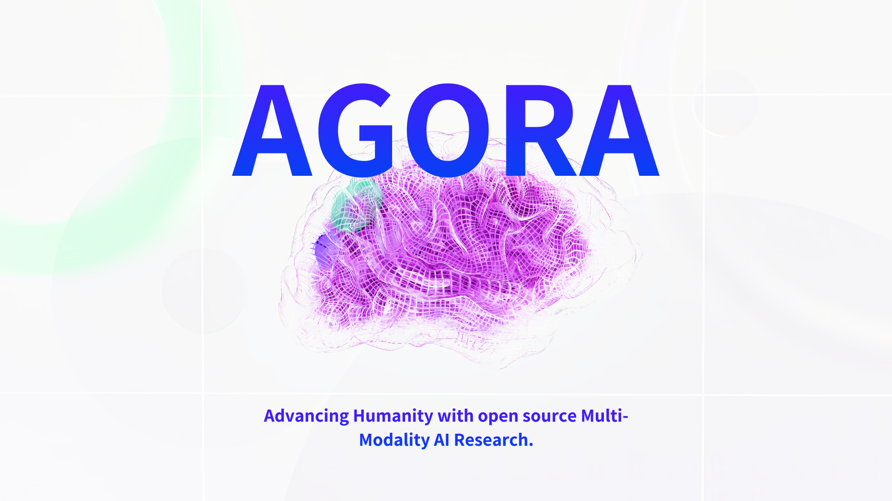

# Agora

[Join the Agora discord here](https://discord.gg/qUtxnK2NMf)

[Learn more about Agora](https://apac.ai/Agora)

Welcome to Agora, where we're advancing humanity with open source multi-modal AI research. Our mission is to unlock the true potential of AI by tackling one of the most complex challenges ever known to humankind: harnessing the power of multi-modality foundation models to revolutionize the world economy. This is the home for our investor presentation.

### Method 1
[Investor presentation figma link](https://www.figma.com/file/sVY4AE67SyjfHCPk1EACO9/Agora-deck?type=design&node-id=149%3A3&t=cNDEDDiu4oGMZm49-1)

### Method2
Download the presentation pdf

[Agora investor presentation](agora-deck-compressed.pdf)

# Key problems we're solving

* Limited AI Capabilities: Unlocking the vast untapped potential of AI beyond basic language models.

* Complex Data Landscape: Effectively processing and analyzing diverse multi-modal data with advanced AI models.

* Scalability & Adaptability: Addressing the challenges of scaling and adapting AI models in an ever-evolving data ecosystem.

* Interconnectedness: Seamlessly integrating and understanding relationships between different data modalities.

* Real-world Applications: Bridging the gap between AI research and practical applications across industries.

# Introducing Agora

Agora is built on the belief that the strength of a network lies in the number of nodes exchanging information within the network. With this in mind, we've set out to create the world's most effective open source AI research organization by integrating millions of developers into our research projects.

## Our master plan is quite simple:

* Initiate: Launch projects with the potential for massive impact, such as creating new foundation models, platforms, and infrastructure.

* Collaborate: Work with enterprises and individuals to solve their most pressing obstacles.

* Optimize, Fine-tune, and Deploy then Iterate quickly: Transform experimental research into seamless and delightful experiences that customers love.

# Active Projects:

We have 30+ active projects, with the most potentially impactful ones listed below. Our main research directions include advancing multi-modality AI reasoning, understanding, and capabilities through multi-modality generation.

* [Kosmos-X, an all-new multi-modality foundation model capable of processing ultra long sequences of images, videos, and audio](https://github.com/kyegomez/Kosmos-X)

* [Andromeda, an all-new language model built from the ground up to process ultra long sequences of 100,000+ tokens ultra fast, ready for training](https://github.com/kyegomez/Andromeda)

* [PALM-E, an multi-modality foundation model that can process long sequences of sensor data, images, and videos with an fast base language model](https://github.com/kyegomez/PALM-E)

* [Tree of Thoughts, an modular plug in and play add-on to boost any model reasoning by 70%](https://github.com/kyegomez/tree-of-thoughts)

Join us on our journey to create cutting-edge multi-modality foundation models that unlock AI's true potential and transform the world economy. Explore our open source investor presentation and learn more about Agora's groundbreaking projects and vision for the future of AI.

# Funding

We're currently seeking to raise 100m$ at a 1billion$ valuation.

Contact Kye at kye@apac.ai if you are potentially interested in investing.

# Share Agora's Presentation
